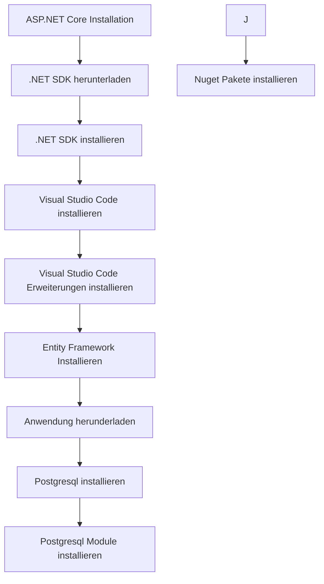

## Installieren




## .NET SDK installieren
Öffne Sie das Terminal und auf ihrem Ubuntu-Desktop
```bash
sudo apt-get update 
sudo apt-get upgrade
sudo apt-get update # Aktualisiert die Paketliste
sudo apt-get install -y dotnet-sdk-9.0 # Installation des .NET SDK
sudo apt-get install -y dotnet-sdk-8.0 # Installation des .NET SDK
echo 'export PATH=$HOME/.dotnet/tools:$PATH' >> ~/.bashrc # Hinzufügen des Pfads zum .bashrc
source ~/.bashrc  # Aktualisierung der .bashrc
```
### Warum beide Versionen von .NET Core?

Softwaremodule sind nicht immer vollständig kompatibel.
## Visual Studio Code Installieren
```bash 
sudo snap install code --classic
```
## Visual Studio Code Erweiterung Installieren
```
code --install-extension ms-dotnettools.csdevkit # Installiert die C# Dev Kit Erweiterung
```
## Entity Framework Installieren
```bash
dotnet tool install --global dotnet-ef
```

## Anwendung herunterladen
```bash
git clone https://github.com/thorstenkloehn/aspnetcoremvc.git
```
## Postgresql installieren
```bash
sudo apt-get install postgresql-all
```
### Postgrsql Module installieren
```bash
sudo apt install postgis postgresql-16-postgis-3 postgresql-16-postgis-3-scripts postgresql-16-pgvector
```
## Nuget Pakete installieren

* [Npgsql](https://www.nuget.org/packages/npgsql/) 
* [Npgsql.EntityFrameworkCore.PostgreSQL.NetTopologySuite](https://www.nuget.org/packages/npgsql.entityframeworkcore.postgresql.nettopologysuite/) 
* [Npgsql.EntityFrameworkCore.PostgreSQL ](https://www.nuget.org/packages/npgsql.entityframeworkcore.postgresql/) 

