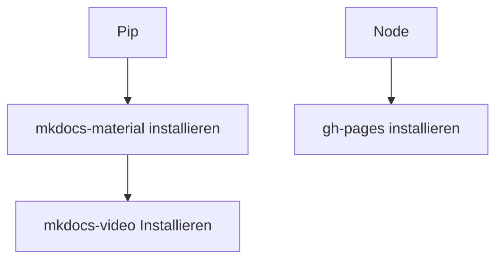

## Mkdocs mit Material Theme installieren
MkDocs mit material ist ein einfaches Werkzeug, um statische Webseiten zu erstellen. Es ist in Python geschrieben und kann mit dem Paketmanager pip installiert werden.
```bash

pip install mkdocs-material
```
## Pflugin mkdocs-material

### Video
Das Plugin mkdocs-video ermöglicht das Einbetten von Videos in die Dokumentation.
```bash
pip install mkdocs-video
```
## node GH-Pages
Das Plugin node gh-pages ermöglicht das Veröffentlichen von Dokumentationen auf GitHub Pages.

```bash
npm install
```
